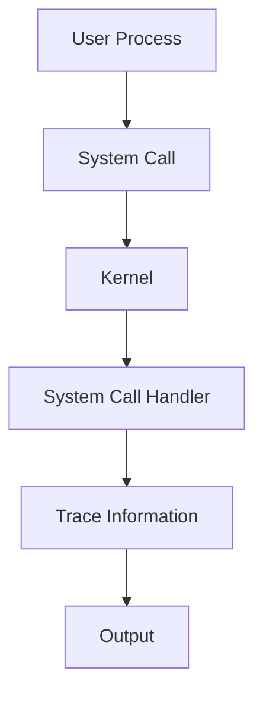
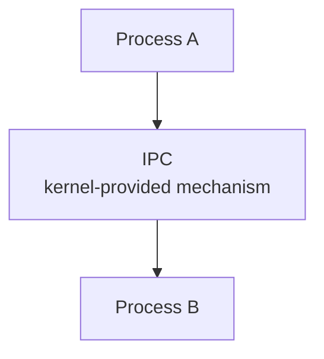
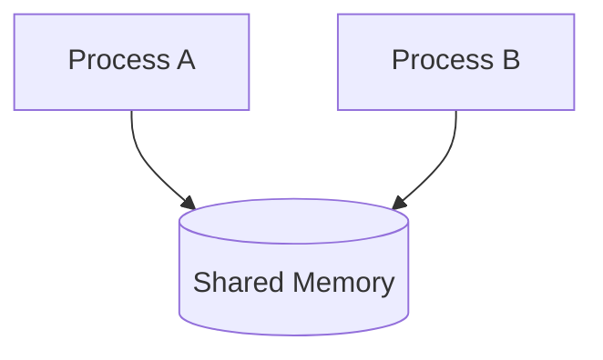
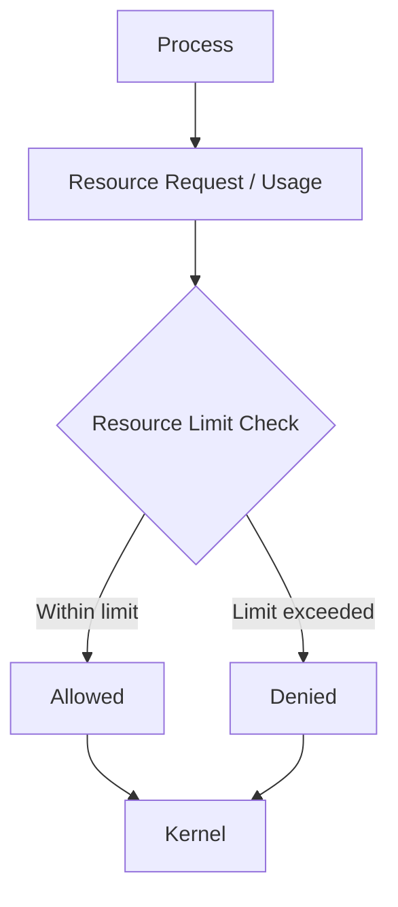
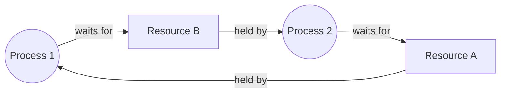
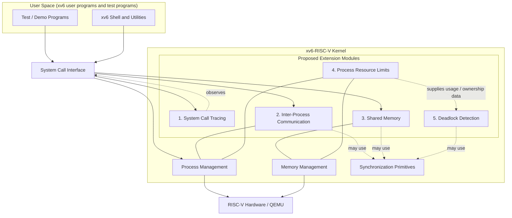
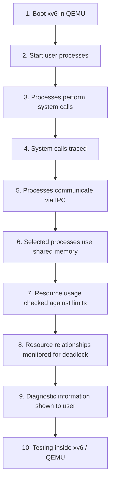
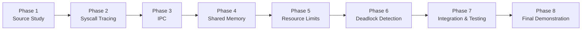

# xv6-RISC-V Kernel Extension Suite: System Call Tracing, IPC, Shared Memory, Resource Limits, and Deadlock Detection

**A university Operating Systems project built on MIT xv6-RISC-V, adding five custom kernel/system modules**

> **Document type:** Project Proposal / Design Plan
> **Project status:** Planning / Module Selection Finalized. No module has been implemented yet.

---

## Table of Contents

1. [Project Overview](#1-project-overview)
2. [Problem Statement](#2-problem-statement)
3. [Project Objectives](#3-project-objectives)
4. [Final Selected Modules](#4-final-selected-modules)
5. [Module 1: System Call Tracing](#5-module-1--system-call-tracing)
6. [Module 2: Inter-Process Communication (IPC)](#6-module-2--inter-process-communication-ipc)
7. [Module 3: Shared Memory](#7-module-3--shared-memory)
8. [Module 4: Process Resource Limits](#8-module-4--process-resource-limits)
9. [Module 5: Deadlock Detection](#9-module-5--deadlock-detection)
10. [Overall System Architecture](#10-overall-system-architecture)
11. [Overall Working Flow](#11-overall-working-flow)
12. [xv6 Component Mapping](#12-xv6-component-mapping)
13. [Learning Outcomes](#13-learning-outcomes)
14. [Development Plan](#14-development-plan)
15. [Testing Strategy](#15-testing-strategy)
16. [Expected Output / Demonstration](#16-expected-output--demonstration)
17. [Technologies](#17-technologies)
18. [Project Structure](#18-project-structure)
19. [Scope and Limitations](#19-scope-and-limitations)
20. [Current Status](#20-current-status)
21. [References](#21-references)

---

## 1. Project Overview

**xv6-RISC-V** is a small teaching operating system developed at MIT. It is a modern re-implementation of the Unix Version 6 design for the 64-bit RISC-V architecture, written in ANSI C. It includes the core parts of a Unix-like system: processes, virtual memory, a system-call interface, a file system, a simple shell, and basic kernel synchronization. The whole kernel is small enough to be read and understood in a single course.

**Why xv6 is used.** Production kernels such as Linux contain millions of lines of code, which makes it hard for a student to trace one feature from user space into the kernel. xv6 is compact, well documented (it has an accompanying book), and runs in the QEMU emulator, so experiments are safe and repeatable.

**What this project aims to extend.** The project will add five custom modules to xv6-RISC-V, so that important Operating Systems concepts can be studied and demonstrated in a working kernel instead of only on paper:

- **System Call Tracing**: observing the interaction between user programs and the kernel.
- **Inter-Process Communication (IPC)**: allowing processes to exchange information.
- **Shared Memory**: allowing processes to access a common memory region under kernel control.
- **Process Resource Limits**: controlling how much of selected resources a process may consume.
- **Deadlock Detection**: identifying situations where processes wait on each other indefinitely.

The focus is on practical, understandable implementations of these concepts, not on production-grade features.

> **Note:** This document is a proposal. Everything described below is planned or proposed behavior unless explicitly stated otherwise.

---

## 2. Problem Statement

Operating Systems courses cover system calls, process communication, memory sharing, resource management, synchronization, and deadlocks. These topics are often taught through diagrams and short pseudo-code. Students can then memorize the definitions without seeing how the mechanisms behave inside a real kernel.

A small educational OS such as xv6 is a suitable place to close this gap:

| Concept | Why it is hard to learn only from theory | What a kernel-level exercise provides |
|---|---|---|
| System calls | The user/kernel boundary is abstract | A concrete path from a user program into kernel code |
| Process communication | Isolation between processes is only described | A real mechanism that crosses process boundaries |
| Memory sharing | Address spaces are usually drawn as boxes | Direct work with how the kernel maps and protects memory |
| Resource management | Limits are described as policy | Real enforcement points where a request can be allowed or denied |
| Synchronization / conflicts | Race conditions are hard to imagine | Observable effects of locking and contention |
| Deadlocks | Usually shown as small textbook graphs | A running system in which waiting relationships can be examined |

Implementing these concepts inside the kernel forces the student to deal with real constraints: limited kernel data structures, locking rules, user/kernel pointer validation, and the lack of a standard library. This gives an understanding that theory alone does not.

---

## 3. Project Objectives

The project aims to:

1. **Understand the xv6 kernel architecture**, including its process, memory, trap, and system-call infrastructure.
2. **Understand how system calls work**, from the user program to the kernel and back.
3. **Observe system-call activity** of running processes through a tracing facility.
4. **Provide an IPC mechanism** between processes (the exact mechanism is to be finalized during the design phase).
5. **Introduce shared-memory based communication** between cooperating processes.
6. **Control process resource usage** through configurable limits on selected resources.
7. **Detect possible deadlock situations** among processes competing for resources.
8. **Understand kernel-level synchronization**, and why shared kernel data must be protected.
9. **Improve practical understanding of Operating Systems** by working directly in kernel code.
10. **Test and demonstrate each module inside xv6**, using QEMU.

The project does not claim to build a complete or production-quality implementation of any of these areas.

---

## 4. Final Selected Modules

The following five modules are final for this project.

| # | Module | Purpose | Main OS Concept |
|---|--------|---------|-----------------|
| 1 | **System Call Tracing** | Will let a user observe which system calls a process makes, to support debugging and learning. | System-call interface, user/kernel boundary |
| 2 | **Inter-Process Communication (IPC)** | Will let separate processes exchange data through a kernel-provided mechanism. | Process cooperation, message/data passing |
| 3 | **Shared Memory** | Will let selected processes access a common memory region in a controlled way. | Virtual memory, address spaces, memory sharing |
| 4 | **Process Resource Limits** | Will check selected process resource usage against configured limits and allow or deny requests. | Resource management, protection, fairness |
| 5 | **Deadlock Detection** | Will examine resource-waiting relationships and report possible deadlock situations. | Deadlock, concurrency, resource allocation |

---

## 5. Module 1 — System Call Tracing

### 5.1 Background

A **system call** is the controlled entry point through which a user program asks the kernel to perform a privileged operation, such as creating a process, reading or writing a file, or allocating memory. User programs run in a restricted mode and cannot perform these operations directly. They must cross into the kernel, which validates the request, performs it, and returns a result.

### 5.2 Why tracing is useful

Observing system calls shows what a program actually asks the OS to do. It is useful because it:

- reveals the real interaction between a program and the kernel;
- helps locate bugs (for example, a call failing unexpectedly or being made too often);
- supports learning by letting students watch the user/kernel boundary in action;
- gives a simple foundation for diagnostics used by other modules.

### 5.3 What the module is intended to observe

The module will provide a way to record system-call activity of selected processes. Information that *could* be traced includes:

- which process made the call;
- which system call was requested;
- the result returned (success or failure);
- optionally, the order or count of calls.

The exact set of recorded fields, the way tracing is enabled, and the output format are **to be finalized during implementation**.

### 5.4 Conceptual flow



> Implementation details (where the tracing hook is placed, how trace state is stored per process) are planned but not yet decided. Relevant xv6 source components will be verified during implementation.

---

## 6. Module 2 — Inter-Process Communication (IPC)

### 6.1 Background

**Inter-Process Communication (IPC)** means the mechanisms an operating system provides so that separate processes can exchange data or coordinate. Because the OS isolates each process in its own address space, processes cannot simply read each other's variables. Communication must go through a mechanism the kernel controls.

### 6.2 Why IPC matters

- Real programs are often split into cooperating processes (for example, a producer and a consumer).
- IPC allows data exchange without sharing a whole address space.
- The kernel can enforce rules about who may communicate and how much data may be buffered.
- It introduces important issues: blocking, buffering, and synchronization.

### 6.3 Proposed extension to xv6

This module will extend xv6 with a kernel-supported way for one process to send information and another to receive it. The module is expected to involve:

- a way for processes to identify a communication channel;
- kernel-side buffering or hand-off of data;
- handling of the case where the receiver is not ready (waiting or reporting an error);
- safe copying of data between user and kernel memory.

### 6.4 Mechanism selection

> **The specific IPC mechanism has not been finalized.** It will be decided during the design/implementation phase, after studying what xv6 already provides and what best demonstrates the intended concepts. This document therefore does not commit to pipes, message queues, sockets, or any other specific mechanism.

### 6.5 Conceptual diagram



---

## 7. Module 3 — Shared Memory

### 7.1 Background

**Shared memory** is a region of memory that more than one process can access. Normally each xv6 process has its own **private** address space, so a write by one process is invisible to the others. With shared memory, the kernel arranges for the same underlying memory to appear in the address spaces of more than one process.

| Property | Normal process memory | Shared memory |
|---|---|---|
| Visibility | Only the owning process | Every process that attaches to it |
| Data exchange | Needs a kernel call per transfer | Direct reads/writes once set up |
| Synchronization | Not needed between processes | Required to avoid conflicting access |
| Kernel role | Allocates and protects | Also sets up and controls the sharing |

### 7.2 Why it is useful for IPC

Once the region is set up, processes can exchange data by ordinary memory reads and writes, without a kernel call for every transfer. This makes it a natural complement to Module 2 and shows the trade-off between *kernel-mediated* and *direct* communication.

### 7.3 Why synchronization becomes important

If two processes update the same memory at the same time, the result can depend on timing (a **race condition**). Shared memory is therefore only safe when access is coordinated. The project will use this module to demonstrate the problem and the need for synchronization.

### 7.4 Proposed module behavior

The module will allow **controlled sharing between processes**. Expected characteristics (all to be finalized during implementation):

- a way for a process to create or request a shared region;
- a way for another process to attach to the same region;
- a way to detach or release it;
- checks so that the kernel keeps control over the region and its lifetime.

### 7.5 Expected benefits and learning outcomes

- clearer understanding of virtual memory and private vs. shared mappings;
- hands-on view of the cost and risk of sharing;
- direct experience with race conditions and why synchronization matters.

### 7.6 Conceptual diagram



> Exact memory-management details are not claimed here. Relevant xv6 source components will be verified during implementation.

---

## 8. Module 4 — Process Resource Limits

### 8.1 Background

A **process resource limit** is a boundary on how much of a given resource a process may use. Operating Systems need such controls because resources are finite and shared between all processes.

### 8.2 Why resource control is needed

Without limits, a single faulty or malicious process can:

- consume most of the available memory, starving others;
- create too many child processes, exhausting kernel process slots;
- hold on to other kernel resources, degrading or blocking the whole system.

Limits protect the system and make resource use more predictable and fair.

### 8.3 Example resources (not a final scope)

The following are **examples only** of resources that may need limits. They are **not** a commitment that all of them will be implemented:

- memory usage of a process;
- CPU-related usage;
- number of child processes or other processes;
- other process-level resources.

> **Final implementation scope:** The specific resources to be limited, and how limits are configured, are **to be finalized during implementation**. The project may implement only a subset of the examples above.

### 8.4 Proposed module behavior

The module will let xv6 monitor and control selected per-process resources. When a process uses or requests a limited resource, the kernel is expected to compare the request against the configured limit and either allow it or deny it. How a denial is reported to the process is to be decided during design.

### 8.5 Conceptual flow



---

## 9. Module 5 — Deadlock Detection

### 9.1 Background

A **deadlock** is a state in which a set of processes are each waiting for a resource held by another process in the set, so none of them can ever continue. Deadlocks are important because they can silently freeze part of a system, and the affected processes cannot recover on their own.

### 9.2 The four Coffman conditions

A deadlock can occur only if all four of the following conditions hold at the same time:

1. **Mutual Exclusion**: a resource can be used by only one process at a time.
2. **Hold and Wait**: a process holds at least one resource while waiting for another.
3. **No Preemption**: a resource cannot be forcibly taken from the process holding it.
4. **Circular Wait**: there is a cycle of processes, each waiting for a resource held by the next.

### 9.3 Detection vs. prevention

| Approach | Idea | Typical cost |
|---|---|---|
| **Prevention** | Design the system so at least one Coffman condition can never hold | Restricts how resources can be requested |
| **Detection** | Allow deadlocks to occur, then examine the system and identify them | Needs bookkeeping and periodic or on-demand checking |

This project concentrates on **detection**: identifying and reporting a possible deadlock, not guaranteeing that one never occurs.

### 9.4 Proposed module behavior

The module is **planned** to track which processes hold and which are waiting for selected resources, and to look for a circular wait among them. If a cycle is found, it is expected to report a possible deadlock to the user. Details such as which resources are tracked, when the check runs, and what happens after detection are **to be finalized during implementation**.

> This module is planned functionality. It is **not** a complete general-purpose deadlock detector, and it is expected to cover only the resource types selected for the project.

### 9.5 Why it is useful for learning

It connects resource management and concurrency: students see how resource ownership and waiting relationships form a graph, and how a cycle in that graph signals a deadlock.

### 9.6 Conceptual diagram: circular resource dependency



Process 1 holds Resource A and waits for Resource B, while Process 2 holds Resource B and waits for Resource A. Neither can proceed.

---

## 10. Overall System Architecture

The five modules are planned as extensions around the xv6 kernel. Tracing observes the system-call path, IPC and shared memory provide communication, resource limits control usage, and deadlock detection examines resource-waiting relationships. Diagnostic results are exposed to the user through user-level programs.



**Reading the diagram:**

- Module 1 observes the system-call path.
- Modules 2 and 3 depend on process management and memory management respectively.
- Module 4 interacts with both process and memory management to check usage.
- Module 5 is expected to rely on resource-ownership information (partly related to Module 4's resource tracking) to look for circular waiting.
- The dotted relationships to synchronization primitives show that kernel synchronization is expected to matter for several modules; the exact usage is to be finalized during implementation.

---

## 11. Overall Working Flow

This is the **planned** workflow for the project once implemented.

1. **Boot xv6** in QEMU.
2. **Start user processes** (test programs launched from the shell).
3. Processes **perform system calls**.
4. **System calls can be traced** for selected processes.
5. Processes **communicate using IPC**.
6. Selected processes **use shared memory**.
7. **Resource usage is checked against limits**.
8. **Resource relationships are monitored** for deadlock conditions.
9. **Results and diagnostic information are exposed** to the user.
10. **Testing is performed** inside xv6/QEMU.



---

## 12. xv6 Component Mapping

The table lists general xv6 areas expected to be relevant to each module. These are **general component names only**. No specific source files or function names are claimed here.

> **Relevant xv6 source components will be verified during implementation.**

| Module | Relevant xv6 Area | Purpose |
|--------|-------------------|---------|
| System Call Tracing | System-call infrastructure; trap handling; process management | Locate where system calls enter and return, and where per-process tracing state could be kept. *To be verified during implementation.* |
| IPC | Process management; sleep/wakeup-style blocking; user/kernel data copying; kernel synchronization | Support sending, receiving, and waiting between processes. *To be verified during implementation.* |
| Shared Memory | Virtual memory management; physical page allocation; process address spaces; process cleanup | Map the same memory into more than one process and manage its lifetime. *To be verified during implementation.* |
| Process Resource Limits | Process management; memory allocation; system-call infrastructure | Track per-process usage and check it at the points where resources are requested. *To be verified during implementation.* |
| Deadlock Detection | Kernel synchronization; process management; resource ownership/waiting information | Record who holds and who waits for selected resources and look for cycles. *To be verified during implementation.* |

---

## 13. Learning Outcomes

By completing this project, students are expected to learn:

- **Kernel/user-space interaction**: how user programs reach kernel services.
- **System calls**: how they are dispatched and how arguments and results are passed.
- **Process management**: how the kernel represents and schedules processes.
- **IPC**: how isolated processes can exchange information.
- **Shared memory**: how the same memory can be exposed to several processes.
- **Memory management concepts**: address spaces, mappings, and page allocation.
- **Resource management**: how limits are defined and enforced.
- **Synchronization**: locking and coordination in a kernel environment.
- **Deadlocks**: causes, conditions, and detection.
- **Kernel debugging**: finding faults in code that runs without a normal debugging environment.
- **OS architecture**: how a small kernel is organized and extended.
- **Practical C programming in a kernel environment**: working without a standard library and with strict safety requirements.
- **QEMU-based testing**: building, running, and testing an OS in an emulator.

---

## 14. Development Plan

This is a **proposed** plan. Phases and their contents may change as the project progresses.

| Phase | Title | Planned Activities |
|-------|-------|--------------------|
| 1 | **xv6 Source Study** | Understand the architecture; build and run xv6; study relevant kernel components |
| 2 | **System Call Tracing** | Design the tracing mechanism; implement; test |
| 3 | **IPC** | Design the communication mechanism (finalize which one); implement; test |
| 4 | **Shared Memory** | Design the shared-memory mechanism; implement; test |
| 5 | **Resource Limits** | Design the limits and decide which resources are covered; implement; test |
| 6 | **Deadlock Detection** | Design the detection logic and covered resources; implement; test |
| 7 | **Integration & Testing** | Test modules together; fix issues; document results |
| 8 | **Final Demonstration** | Prepare examples; prepare screenshots/output; finalize documentation |



---

## 15. Testing Strategy

The following tests are **planned**. No tests have been run, and no results are claimed.

### 15.1 System Call Tracing
- Execute processes with tracing enabled.
- Trigger a known set of system calls.
- Verify that the trace output matches the calls actually made.

### 15.2 IPC
- Create communicating processes.
- Send and receive information.
- Verify that data arrives correctly, including when one side must wait.

### 15.3 Shared Memory
- Create processes and set up a shared region.
- Modify and read shared data from different processes.
- Verify expected behavior, including behavior when a process exits.

### 15.4 Resource Limits
- Configure a limit for a selected resource.
- Intentionally approach and exceed the limit.
- Verify that the kernel allows requests within the limit and denies those beyond it, without harming the rest of the system.

### 15.5 Deadlock Detection
- Create controlled resource-dependency scenarios, both with and without a cycle.
- Verify that a deadlock is reported when a cycle exists and not reported when it does not.

### 15.6 Integration Testing
- Run the modules together (for example, tracing an IPC test, or running a shared-memory test under a resource limit).
- Check that modules do not interfere with one another or destabilize the kernel.
- Run the existing xv6 user tests to confirm that normal xv6 behavior is preserved.

---

## 16. Expected Output / Demonstration

The final demonstration is expected to show:

| Module | Expected demonstration |
|--------|------------------------|
| System Call Tracing | Trace output for a selected process |
| IPC | Two processes exchanging information |
| Shared Memory | Processes interacting through a shared region |
| Resource Limits | Enforcement when a configured limit is reached |
| Deadlock Detection | A notification/report when a deadlock scenario is created |

Placeholders for results (no real output exists yet):

```
[Example output will be added after implementation]
```

- System Call Tracing: `[Example output will be added after implementation]`
- IPC: `[Example output will be added after implementation]`
- Shared Memory: `[Example output will be added after implementation]`
- Resource Limits: `[Example output will be added after implementation]`
- Deadlock Detection: `[Example output will be added after implementation]`

---

## 17. Technologies

| Technology | Role in the project |
|------------|---------------------|
| **C** | Language for the kernel and user programs |
| **RISC-V** | Target instruction set architecture |
| **MIT xv6-RISC-V** | Base operating system |
| **QEMU** | Emulator for running and testing xv6 |
| **GNU Make** | Building xv6 and running it in QEMU |
| **Git** | Version control |
| **GitHub** | Hosting and collaboration |
| **Linux / WSL** (or another supported xv6 environment) | Development environment |

---

## 18. Project Structure

The structure below is **conceptual**, based on the general layout of the xv6-RISC-V repository. Module-specific source files have not been created yet.

```
xv6-riscv/
├── kernel/        # xv6 kernel source (extension code will be added here)
├── user/          # user programs (test programs will be added here)
├── Makefile       # build and QEMU run configuration
└── ...            # other xv6 files
```

Module-specific source files, test programs, and any build changes will be **finalized during implementation**. This section will be updated once they exist.

---

## 19. Scope and Limitations

- xv6 is an **educational** operating system, not a production system.
- The project is intended for **learning and demonstration**.
- Implementations may be **simplified** compared with production operating systems.
- The modules are **not** intended to provide production-level security or performance.
- Implementation details **may evolve** during development.
- Only the **five selected modules** are currently in scope.
- Resource-limit coverage and deadlock-detection coverage are expected to be limited to the resources selected during design.

---

## 20. Current Status

**Project Status: Planning / Module Selection Finalized**

- MIT xv6-RISC-V has been selected as the base operating system.
- The five modules are finalized: System Call Tracing, IPC, Shared Memory, Process Resource Limits, and Deadlock Detection.
- Implementation has **not** been completed.
- Detailed design and implementation will follow, according to the development plan above.

---

## 21. References

1. MIT xv6-RISC-V official repository: <https://github.com/mit-pdos/xv6-riscv>
2. xv6-RISC-V official book: <https://github.com/mit-pdos/xv6-riscv-book>
